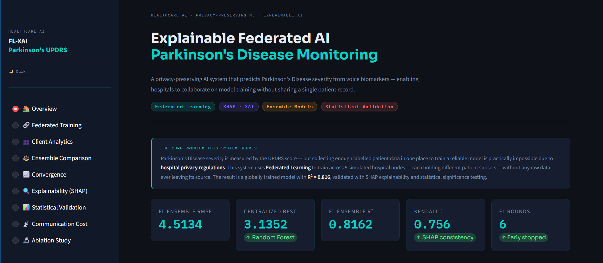
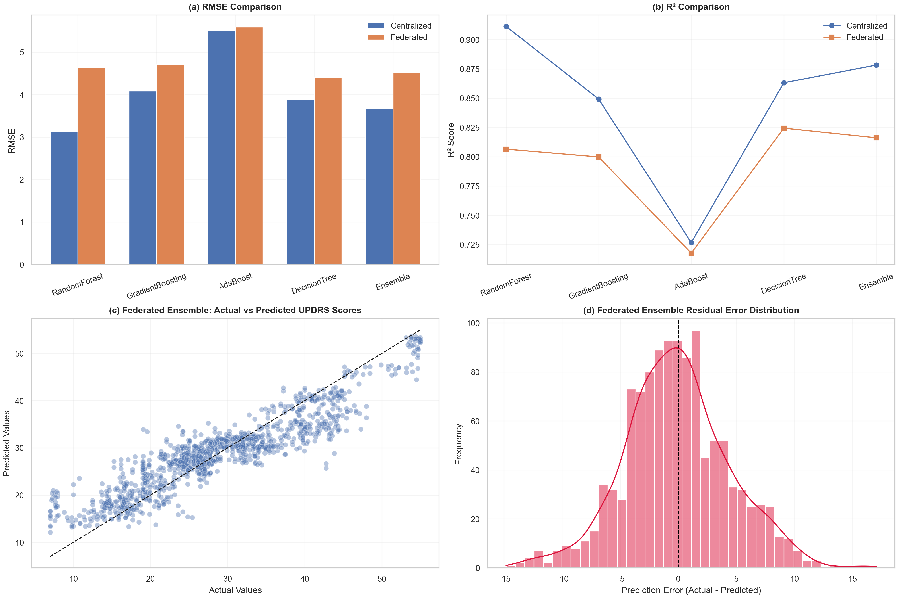
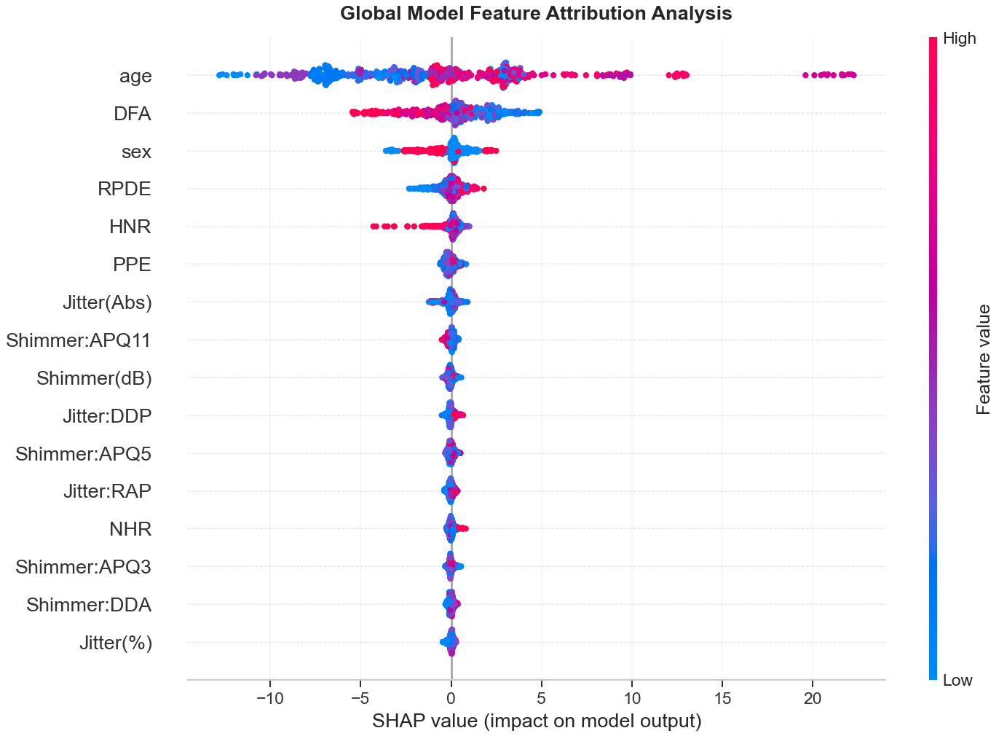
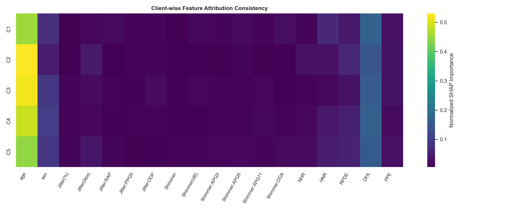
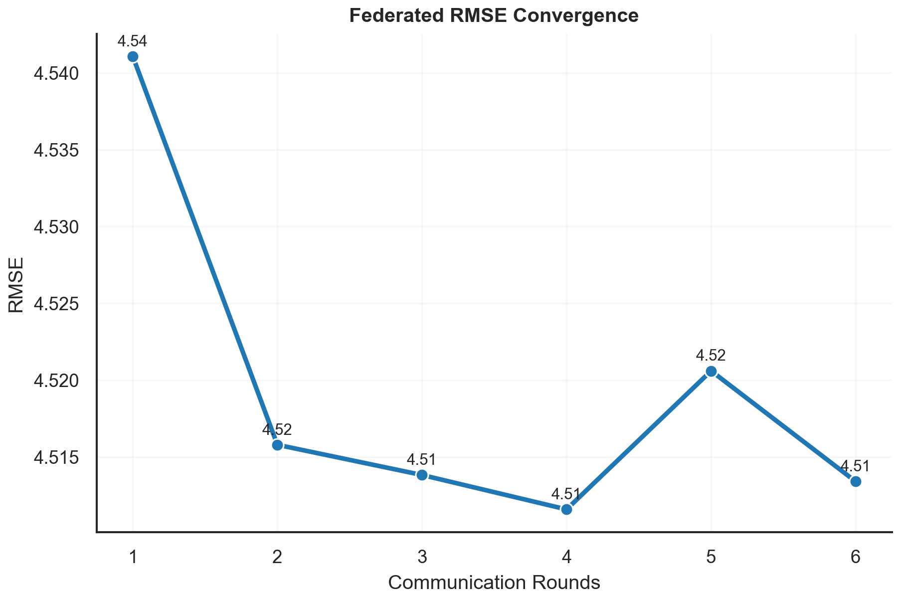
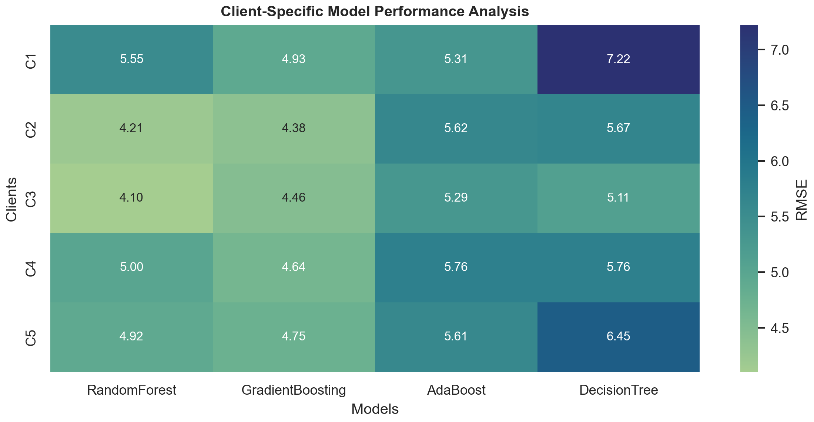

<div align="center">

<br/>

# Explainable Federated AI
## for Parkinson's Disease Monitoring

<br/>

<p align="center">
  
</p>

<br/>

<p align="center">
  
  &nbsp;
  
  &nbsp;
  
  &nbsp;
  
  &nbsp;
  
</p>

<br/>

</div>

---

## The Problem

Over **10 million people worldwide** live with Parkinson's Disease.

Tracking its progression typically requires repeated clinical visits — costly, infrequent, and inaccessible for many patients. Voice biomarkers captured through remote telemetry offer a non-invasive alternative.

But there is a critical challenge in healthcare AI:

> Patient data cannot be shared across hospitals. <br/>
> Building a reliable model across institutions — without moving sensitive records — requires a fundamentally different approach.

This project tackles exactly that.

---

## What It Does

A privacy-preserving AI system that predicts Parkinson's Disease severity from voice recordings — enabling institutions to collaborate on model training **without sharing a single patient record.**

Predictions are paired with clinically interpretable explanations, so clinicians understand not just *what* the model predicts — but *why.*

<br/>

<p align="center">
  
</p>

---

## Dashboard Highlights

<table>
<tr>
<td width="50%" align="center">
  
  <br/><br/>
  <b>Feature Importance Analysis</b>
  <br/>
  <sub>Understand which voice biomarkers drive severity predictions — globally and per patient.</sub>
</td>
<td width="50%" align="center">
  
  <br/><br/>
  <b>Global Explainability Overview</b>
  <br/>
  <sub>Visual attribution maps across all contributing data sources.</sub>
</td>
</tr>
<tr><td colspan="2"><br/></td></tr>
<tr>
<td width="50%" align="center">
  
  <br/><br/>
  <b>Model Learning Behaviour</b>
  <br/>
  <sub>Track how the global model improves across training iterations.</sub>
</td>
<td width="50%" align="center">
  
  <br/><br/>
  <b>Site-Level Performance Analytics</b>
  <br/>
  <sub>Monitor prediction quality across each contributing institution.</sub>
</td>
</tr>
</table>

---

## Key Results

<div align="center">

| Metric | Score |
|--------|:-----:|
| Best RMSE | **3.14** |
| Best R² | **0.911** |
| Target | Total UPDRS |

*Evaluated on the Oxford Parkinson's Telemonitoring Dataset.*

</div>

---

## Features

**Privacy by Design**
Institutions collaborate on a shared model without exposing raw patient data. No records leave their source.

**Explainable Predictions**
Every prediction is accompanied by a feature-level explanation — making the system interpretable for clinical use.

**Multi-Model Analytics**
Performance across multiple modeling approaches is tracked, compared, and visualized interactively.

**Research-Grade Dashboard**
Nine analytical panels covering model performance, explainability, learning dynamics, and site-level insights.

---

## Technology Stack

<div align="center">

| | |
|---|---|
| **Modeling** | Scikit-Learn · NumPy · Pandas |
| **Explainability** | SHAP |
| **Dashboard** | Streamlit · Plotly |
| **Validation** | SciPy |
| **Language** | Python 3.9+ |

</div>

---

## Dataset

**Oxford Parkinson's Telemonitoring Dataset**

Biomedical voice recordings from patients with Parkinson's Disease, collected via remote telemetry. Publicly available through the UCI Machine Learning Repository.

*(A. Tsanas, M.A. Little, P.E. McSherrys, L.O. Ramig — IEEE Transactions on Biomedical Engineering, 2009)*

---

## Run the Dashboard

```bash
git clone https://github.com/bhoomikagoel24/fl-xai-parkinsons.git
cd fl-xai-parkinsons
pip install -r requirements.txt
streamlit run dashboard/app.py
```

Opens at `http://localhost:8501`

---

<div align="center">

<br/>

*Built at the intersection of healthcare, privacy, and explainable AI.*

<br/>

<sub>Healthcare AI &nbsp;·&nbsp; Privacy-Preserving ML &nbsp;·&nbsp; Explainable AI &nbsp;·&nbsp; Parkinson's Disease</sub>

<br/><br/>

</div>