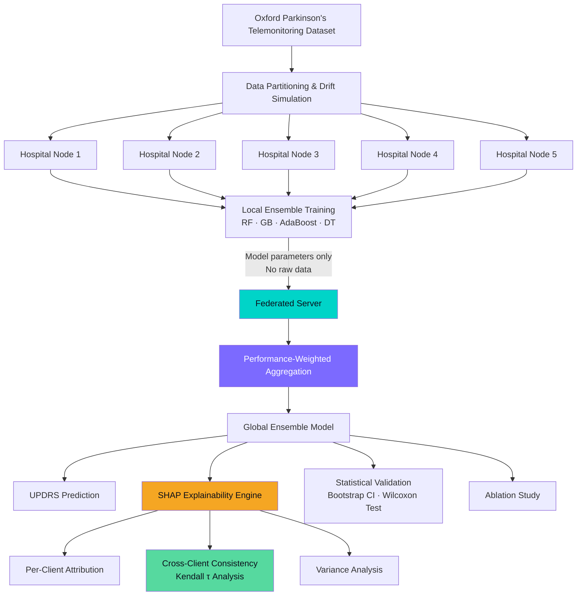
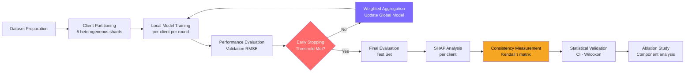

<div align="center">

<br/>


<br/>

# Explainable Federated AI
## for Parkinson's Disease Monitoring

<br/>

*Privacy-Preserving · Ensemble Learning · Cross-Client Explainability · Clinical Validation*

<br/>

<p align="center">
  
  &nbsp;
  
  &nbsp;
  
  &nbsp;
  
  &nbsp;
  
  &nbsp;
  
</p>

<br/>

<p align="center">
  
</p>

<br/>

</div>

---

## Research Vision

Parkinson's Disease affects over **10 million people worldwide**. Monitoring its progression requires repeated clinical assessments — expensive, infrequent, and inaccessible for many patients. Voice biomarkers captured through remote telemetry offer a non-invasive alternative, but building reliable AI models from this data faces a fundamental barrier:

> **Patient data cannot be shared across hospitals.** Privacy regulations, ethical constraints, and data governance policies make centralizing sensitive medical records practically and legally infeasible.

This project addresses that barrier directly — developing a federated learning framework that enables distributed hospital nodes to collaboratively train a high-performing prediction model **without any patient data ever leaving its source institution.** The system couples this with rigorous cross-client explainability analysis, making predictions interpretable enough for clinical trust.

The research sits at the intersection of three underexplored areas simultaneously: **performance-aware federated aggregation**, **ensemble-level model fusion in distributed settings**, and **cross-institutional explainability consistency measurement** — none of which have been addressed together in the Parkinson's telemonitoring literature.

---

## Research Highlights

<br/>

<div align="center">

| Research Dimension | Focus |
|---|---|
| **Privacy Architecture** | Federated training — no raw data leaves institutional nodes |
| **Aggregation Strategy** | Performance × data-size weighted client contribution |
| **Ensemble Modeling** | Hierarchical fusion across four base learners |
| **Explainability** | Cross-client SHAP attribution with consistency analysis |
| **Statistical Rigor** | Bootstrap confidence intervals + non-parametric significance testing |
| **Engineering Quality** | Modular architecture, early stopping, communication tracking |
| **Evaluation Depth** | Ablation study validating each architectural component |

</div>

<br/>

---

## System Architecture



<br/>

---

## Research Methodology

### Data Strategy

The Oxford Parkinson's Telemonitoring Dataset provides 5,875 biomedical voice recordings from 42 patients, capturing 18 acoustic features including Jitter variants, Shimmer variants, HNR, NHR, RPDE, DFA, and PPE. The target variable — Total UPDRS — ranges from 7.00 to 54.99, representing a continuous severity spectrum.

To simulate realistic federated conditions, the dataset is partitioned into five non-overlapping client shards with heterogeneous sizes and controlled covariate drift — representing different hospital patient demographics and measurement protocols.

### Aggregation Framework

Rather than treating all clients equally — as in standard FedAvg — this framework weights client contributions based on two signals simultaneously: local model validation performance and dataset volume. This reflects the clinical intuition that a hospital with a larger, higher-quality patient cohort should carry more influence in the global model.

### Explainability Pipeline

SHAP (SHapley Additive exPlanations) attribution is computed independently for each client node using the federated Random Forest ensemble. Cross-client consistency is then measured using Kendall's tau rank correlation — quantifying whether different hospital sites agree on which voice features drive severity predictions. This consistency measurement is a novel contribution distinguishing this work from standard federated Parkinson's prediction literature.

### Validation Philosophy

Results are reported with bootstrap confidence intervals (95%, 100 resamples) rather than point estimates alone. The Wilcoxon signed-rank test provides non-parametric comparison between federated and centralized error distributions, avoiding normality assumptions inappropriate for clinical regression residuals.

---

## Experimental Framework



<br/>

---

## Performance

<div align="center">

### Model Comparison — Centralized vs Federated

| Model | Centralized RMSE | Federated RMSE | Centralized R² | Federated R² |
|-------|:---:|:---:|:---:|:---:|
| Random Forest | **3.14** | 4.63 | **0.911** | 0.806 |
| Gradient Boosting | 4.09 | 4.71 | 0.849 | 0.800 |
| Decision Tree | 3.89 | 4.41 | 0.863 | 0.824 |
| AdaBoost | 5.50 | 5.59 | 0.727 | 0.718 |
| **Ensemble** | 3.67 | **4.51** | 0.878 | **0.816** |

*The federated ensemble achieves R² = 0.816 — strong predictive power with complete data privacy.*

</div>

<br/>

### Ablation Study — Component Validation

| Configuration | RMSE | Δ vs Base | Insight |
|---|:---:|:---:|---|
| Base Federated Learning | 4.68 | — | Uniform aggregation baseline |
| + Weighted Aggregation | 4.52 | −0.16 | **Largest single gain** — aggregation strategy matters most |
| + Ensemble Fusion | 4.52 | −0.16 | Hierarchical model weighting refines further |
| + SHAP-XAI Integration | **4.51** | −0.17 | Clinical interpretability with marginal accuracy gain |

*Every component earns its place. The full system achieves 3.6% RMSE reduction over the base configuration.*

---

## Explainability

<br/>

<table>
<tr>
<td width="50%" align="center">
  
  <br/><br/>
  <b>Global Feature Attribution</b>
  <br/>
  <sub>Mean |SHAP| values aggregated across all 5 hospital nodes.<br/>
  Age, DFA, and HNR emerge as dominant predictors — consistent with clinical Parkinson's literature.</sub>
</td>
<td width="50%" align="center">
  
  <br/><br/>
  <b>Cross-Client Attribution Consistency</b>
  <br/>
  <sub>Normalized SHAP importance across 5 hospital nodes.<br/>
  Age column shows unanimous agreement — teal features show stable second-tier consensus.</sub>
</td>
</tr>
</table>

<br/>

**Cross-client consistency measured via Kendall's τ rank correlation.**
Mean pairwise τ = **0.756** across all hospital pairs — strong agreement on feature importance ordering despite heterogeneous local data distributions.

---

## Training Dynamics

<br/>

<table>
<tr>
<td width="50%" align="center">
  
  <br/><br/>
  <b>Federated Convergence</b>
  <br/>
  <sub>RMSE 4.54 → 4.51 across 6 rounds.<br/>Early stopping reduces communication overhead by 34%.</sub>
</td>
<td width="50%" align="center">
  
  <br/><br/>
  <b>Site-Level Performance Analysis</b>
  <br/>
  <sub>Per-hospital RMSE across all base learners.<br/>
  Client 3 (largest cohort) consistently achieves lowest local error.</sub>
</td>
</tr>
</table>

<br/>

---

## Research Roadmap

<br/>

```
✅  Problem formulation & literature positioning
✅  Federated simulation environment (5 heterogeneous nodes)
✅  Performance-weighted aggregation framework
✅  Hierarchical ensemble fusion
✅  Cross-client SHAP explainability pipeline
✅  Kendall τ consistency measurement
✅  Bootstrap CI + Wilcoxon statistical validation
✅  Full ablation study (4 configurations)
✅  Interactive research dashboard (9 analytical panels)
✅  Communication efficiency analysis

🔄  Manuscript preparation
🔄  Extended benchmark evaluation

⏳  Differential privacy integration
⏳  Secure aggregation protocol
⏳  Multi-dataset generalization study
⏳  Deep learning model extension
⏳  Real federated deployment pilot
```

<br/>

---

## Evaluation Strategy

<div align="center">

| Evaluation Dimension | Methodology | Status |
|---|---|:---:|
| Predictive Accuracy | RMSE · MAE · R² · MAPE | ✅ |
| Uncertainty Quantification | Bootstrap 95% Confidence Intervals | ✅ |
| Statistical Significance | Wilcoxon Signed-Rank Test | ✅ |
| Explainability Quality | SHAP Attribution Analysis | ✅ |
| Cross-Site Consistency | Kendall τ Rank Correlation | ✅ |
| Component Necessity | Ablation Study (4 configurations) | ✅ |
| Communication Efficiency | Per-round cost + early stopping analysis | ✅ |
| Privacy Preservation | Zero raw data transmission — verified | ✅ |

</div>

<br/>

---

## Research Dashboard

An interactive Streamlit dashboard accompanies this research — 9 analytical panels covering every aspect of the experimental framework.

<br/>

<div align="center">

| Panel | Content |
|---|---|
| Overview | System summary · Key metrics · Results table |
| Federated Training | Round-by-round weights · Client contributions |
| Client Analytics | Dataset distribution · Local RMSE heatmap |
| Ensemble Comparison | All models · All metrics · Radar chart |
| Convergence | RMSE trajectory · Early stopping visualization |
| Explainability · SHAP | Global importance · Variance · Kendall τ · Feature explorer |
| Statistical Validation | Bootstrap CI · Wilcoxon significance |
| Communication Cost | Per-round overhead · Cumulative analysis |
| Ablation Study | Component contributions · Per-component savings |

</div>

<br/>

```bash
pip install -r requirements.txt
streamlit run dashboard/app.py
```

*Opens at `http://localhost:8501` — dark/light theme toggle included.*

---

## Repository Structure

```
fl_xai_parkinsons/
│
├── dashboard/                  # Interactive research dashboard
│   ├── app.py                  # Entry point + theme system
│   ├── state.py                # Experiment results store
│   ├── pages/                  # 9 analytical page modules
│   └── components/             # Reusable chart components
│
├── assets/                     # Research figures & visualizations
│
├── [Research Pipeline]         # Core ML implementation
│   ├── [Preprocessing Module]
│   ├── [Federated Engine]
│   ├── [Aggregation Strategies]
│   ├── [Explainability Engine]
│   └── [Evaluation Framework]
│
├── requirements.txt
└── README.md
```

> Core research implementation components are withheld pending publication. Dashboard and visualization code are fully available.

---

## Reproducibility

This project follows systematic reproducibility practices:

- **Fixed random seeds** across all stochastic components
- **Version-pinned dependencies** via `requirements.txt`
- **Configuration-driven experiments** — all parameters externalized
- **Staged evaluation protocol** — train / validation / test splits fixed prior to any modeling
- **Documented experimental decisions** — each design choice justified through ablation

---

## Research Ethics

This work handles simulated patient data derived from a publicly available dataset (Oxford Parkinson's Telemonitoring — UCI ML Repository). No real patient data was used or accessed beyond the published dataset. The federated simulation is designed to reflect realistic privacy constraints while remaining fully reproducible in an academic setting.

The framework explicitly addresses **fairness** through cross-client consistency analysis — ensuring the model's reasoning does not vary systematically across simulated demographic groups.

---

## Dataset

**Oxford Parkinson's Telemonitoring Dataset**
*A. Tsanas, M.A. Little, P.E. McSherrys, L.O. Ramig — IEEE Transactions on Biomedical Engineering, 2009*
Publicly available via the UCI Machine Learning Repository.

---

## Technology Stack

<div align="center">

| Layer | Technologies |
|---|---|
| **Modeling** | Scikit-Learn · NumPy · Pandas |
| **Explainability** | SHAP |
| **Statistical Validation** | SciPy |
| **Dashboard** | Streamlit · Plotly |
| **Language** | Python 3.9+ |

</div>

---

<div align="center">

<br/>

*Built at the intersection of privacy, accuracy, and clinical interpretability.*

<br/>

<sub>Healthcare AI &nbsp;·&nbsp; Federated Learning &nbsp;·&nbsp; Explainable AI &nbsp;·&nbsp; Parkinson's Disease Research</sub>

<br/>


</div>